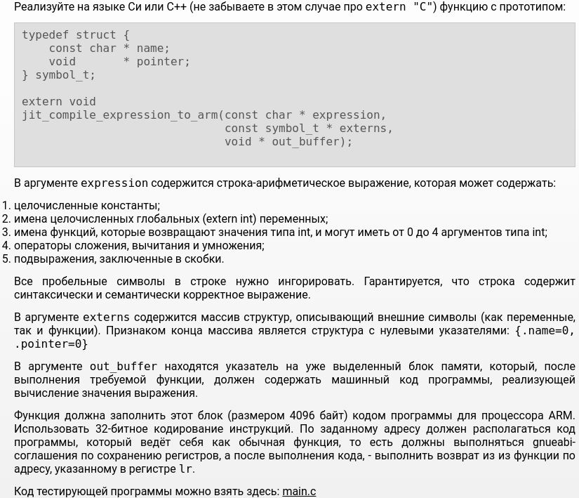
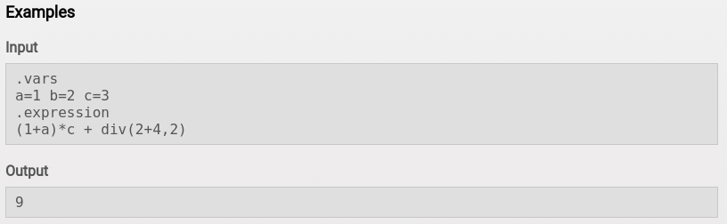

# advanced1

## problem

  
## test launch  
  parser_test:  
    1) change directory to project directory  
    2) type in console:  
 - $ cd parser_test  
 - $ sudo chmod +x parser_test.sh  
 - $ ./parser_test.sh  
   
   to see tests check tests.txt  
  
  jit_compiler tests:  
    1) change directory to project directory  
    2) type in console:  
 - $ cd tests  
 - $ sudo chmod +x test.sh  
 - $ ./test.sh  
  
   to see tests check tests.txt  
  
  stress_test:  
    1) change directory to project directory  
    2) type in console:
 - $ cd stress_test  
 - $ sudo chmod +x stress.sh  
 - $ ./stress.sh  

If program outputs WA, testing will stop and log.txt file will be created. It will contain test, which was failed, correct answer and program output.
